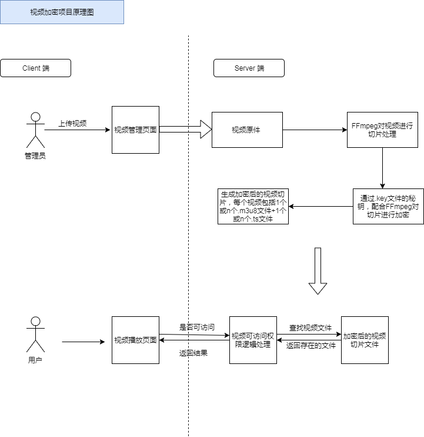

## 深入浅出基于HLS流媒体协议视频加密的解决方案

　　一套简单的基于HLS流媒体协议，使用video.js + NodeJS + FFmpeg等相关技术实现的m3u8+ts+aes128视频加密及播放的解决方案示例。

### 目录

* [项目简介](#项目简介)
* [项目启动](#项目启动)
* [项目原理](#项目原理)
* [技术栈](#技术栈)
* [源码简析](#源码简析)
* [建议](#建议)

#### 项目简介
　　起初是为了将工作中已有的基于Flash的视频播放器替换为不依赖Flash的HTML5视频播放器，主要使用了现有的video.js开源播放器做的定制化开发。当完成视频播放器的制作后，在进一步延伸Web端视频加密的相关内容时，开始了解并逐渐深入的研究了相关视频加密内容。最终通过整理归纳，以及自身的理解，做了这个简单的Demo。目的是为了能够给在视频加密这方面有相同目的的道友提供微薄的帮助，要是能起到抛砖引玉的效果，自然是再好不过了。

#### 项目启动
> 1.安装项目环境

* 安装node、npm环境
* 根据app目录下的package.json安装对应的npm包
* 安装ffmpeg

> 2.启动项目

* 在app目录下，输入`npm start`，启动项目
* 在浏览器中访问 `http://localhost:3000`
* 按照页面中的顺序进行相关操作


#### 项目原理
　　本项目的核心原理其实就是讲解了一个视频源从正常的mp4格式如何变为加密后的m3u8文件+ts文件+key秘钥文件，之后又如何在服务端被限制访问，最终能够在客户端正常播放的视频加密、解密并播放的流程。


> 项目原理图示




#### 技术栈
* NodeJS + Express 实现服务器开发
* FFmpeg + fluent-ffmpeg 实现node环境下的视频转码、加密
* socket.io 通过websocket相关的类库，实现实时输出FFmpeg进行的视频转码、加密操作
* video.js + videojs-contrib-hls.js 实现客户端的视频解密及播放
* html + css + js 实现简单的前端开发                                                                                                                                                                                                                                                                                                  

#### 源码简析 

> 项目目录说明

```
video-hls-encrypt/                   .............................. hls视频加密项目根目录
├── app/                             .............................. express框架默认的app根目录
│   ├── bin/                         .............................. express框架启动的bin目录
│   │   └── www                      .............................. express框架启动的www文件
│   ├── controllers/                 .............................. 项目控制器目录，服务器相关的逻辑代码
│   │   ├── encrypt.js               .............................. 加密逻辑代码
│   │   └── upload.js                .............................. 上传逻辑代码
│   ├── node_modules/                .............................. express框架需要的相关npm依赖包，即package.json文件相对应的依赖包
│   │   └── ...
│   ├── public/                      .............................. express框架静态文件目录，客户端请求的相关静态文件
│   │   ├── javascripts              .............................. 客户端的js文件目录
│   │   │   ├── encrypt.js           .............................. 加密功能相关逻辑代码
│   │   │   ├── index.js             .............................. 主页相关逻辑代码
│   │   │   ├── player.js            .............................. 播放器相关逻辑代码
│   │   │   ├── socket.io.js         .............................. socket.io.js 类库源文件
│   │   │   └── utils.js             .............................. 工具类
│   │   ├── key/                     .............................. 秘钥相关目录
│   │   │   ├── encrypt.key          .............................. 秘钥文件
│   │   │   └── key_info.key         .............................. ffmpeg加密视频转换相关文件
│   │   ├── libs/                    .............................. 第三方类库目录
│   │   │   ├── videojs/             .............................. videojs 相关代码
│   │   │   └── videojs-contrib-hls/ .............................. videojs-contrib-hls 相关代码
│   │   ├── stylesheets/             .............................. css样式目录
│   │   │   └── common.css           .............................. 通用样式表
│   │   └── videos/                  .............................. 视频资源目录
│   │       ├── encrypt/             .............................. 加密后的视频资源目录
│   │       └── noencrypt/           .............................. 加密前的视频资源目录
│   ├── routes/                      .............................. express框架路由目录
│   │   └── router.js                .............................. express路由
│   ├── views/                       .............................. express框架ejs模板目录
│   │   ├── encrypt.ejs              .............................. 视频加密页面
│   │   ├── error.ejs                .............................. 错误页面
│   │   ├── index.ejs                .............................. 主页
│   │   ├── login.ejs                .............................. 登录页面
│   │   ├── player.ejs               .............................. 播放器页面
│   │   └── upload.ejs               .............................. 上传视频页面
│   ├── app.js                       .............................. express程序入口
│   ├── nodemon.json                 .............................. node服务器热更新插件nodemon对应的配置文件
│   └── package.json                 .............................. express框架需要的第三方依赖包配置文件
├── .gitignore
├── README.md                        .............................. 项目说明文档
└── TODO-List.md                     .............................. 项目开发计划文档
```

> 源码简析

* 简单的权限判断，app.js中：
    * express的中间件
    * 判断请求的后缀
    * 判断session中是否有用户名，有则允许访问 .key文件；没有则禁止访问 
    * 主要是保护.key文件，可以加入其它的权限手段，比如token、session有效时长等等
```
//静态资源访问限制
app.use(function (req, res, next) {
    var suffix = /(\.key)$/g;//后缀格式指定
    if ( suffix.test(req.path)) {
        console.log(req.session.username,'++++请求key文件了');
        if((req.session.username != 'admin')){
            return res.send('请求非法');
        }else{
            console.log('+++++请求key文件了，并且已经登录，登录名为：',req.session.username);
            next();
        }
    }
    else {
        next();
    }
});
```

* 利用FFmpeg对视频进行加密、切片处理，在encrypt.js中： 
    * 利用了FFmpeg的切片和加密方法
    * 建议可以深入研究FFmpeg框架的相关api
    * 可以根据实际业务来对视频进行更符合要求的切片处理
```
/**
 * 加密处理方法
 * @param options 加密数据的相关参数
 * @param socket socket输出
 * @param callback 回调函数
 */
function encryptFun(options,socket, callback) {
    var _name = options.fileName.split('.')[0];
    var _type = options.fileName.split('.')[1];
    var _encryptPath = options.encryptPath + '/' + _name;
    var _videoPath = options.noencryptPath + '/' + options.fileName;
    var _keyInfoPath = './public/key/key_info.key';
    var _outputPath = _encryptPath + '/playlist.m3u8';
    console.log('begin encrypt Fun');
    if (_type == 'mp4') {
        ffmpegCommand(_videoPath)
            .addOption('-hls_time', '10')   //设置每个片段的长度
            .addOption('-hls_key_info_file', _keyInfoPath)
            .save(_outputPath)
            .on('end', function () {
                socket.emit('encrypt-event',{msg:'Encrypt the ' + options.fileName + ' file OK!',type:1});
                callback(null, 'Encrypt the ' + options.fileName + ' file OK!');
            })
            .on('stderr', function (stderrLine) {
                console.log('Stderr output: ' + stderrLine);
                socket.emit('encrypt-event',{msg:stderrLine});
            })
            .on('error', function (err, stdout, stderr) {
                console.log('Cannot process video: ' + err.message);
                socket.emit('encrypt-event',{msg:err.message});
                callback(err, err.message);
            });
    }
    else{
        callback('type err','file type is not mp4.');
    }
}
```

* 视频播放相关逻辑，player.ejs中：
    * 使用了videojs作为播放器插件
    * 使用了videojs-contrib-hls作为切片流解码插件
    * 具体的逻辑代码在player.js中

```
<script src="javascripts/utils.js"></script>
<script src="libs/videojs/video.min.js"></script>
<script src="libs/videojs-contrib-hls/videojs-contrib-hls.js"></script>
<script src="javascripts/player.js"></script>
```
#### 建议

* 本项目更多的价值在于展示出一整套的加密原理，同时为了证明这套原理的可行性，做的比较简单的示例。
* 本项目不会提供相关技术栈的使用教程。
* 如果需要在实际应用中使用相关原理或技术栈，建议根据实际项目对部分或整体解决方案进行完善和扩展。

#### 杂谈
_以下的内容均为个人观点，仅供参考_

　　由于本人自身是做前端开发的，所以很多相关的示例都是基于前端考虑，对于后端的相应的策略并不是很专业。比如后端服务器，也采用的是偏前端的`NodeJS`。我想表达的是，在整套解决方案中，我主要做了3件事：
* 第一，把mp4的视频源通过`FFmpeg`转换为加密后的`m3u8`文件和`ts`文件以及关键的加密密钥`key`文件；
* 第二，通过最简单的权限访问，保护加密密钥key文件；
* 第三，利用`video.js`及相关的`videojs-contrib-hls.js`实现客户端的视频文件解密，并播放。

　　因此可以看出关于视频加密的解决方案中，最重要的其实是如何保护加密密钥`key`文件，而这部分工作更多的是在于服务器端的相关策略，比如可以使用`cookie`、`session`相关技术、添加自定义`token`校验、有效时长机制等等方法保证秘钥key文件的相对安全性、可靠性。
　
 
　　而如何将视频源文件转化为对应的加密后的文件，可以更多的研究开源库`FFmpeg`的使用，甚至如果没有迫切需求，可以考虑使用第三方视频云服务商的相关解决方案。至于客户端的视频解密，也可以研究`video.js`相关的内容。

## 浏览知识共享许可协议

<a rel="license" href="http://creativecommons.org/licenses/by-sa/4.0/"></a><br />本作品采用<a rel="license" href="http://creativecommons.org/licenses/by-sa/4.0/">知识共享署名-相同方式共享 4.0 国际许可协议</a>进行许可。